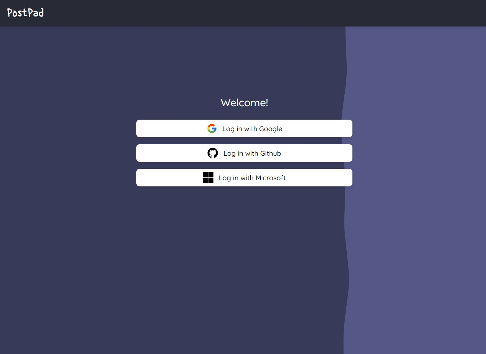

# PostPad

A sample application using the new experimental app directory.

## What is PostPad?

PostPad allow you to create and share posts.

> **Website**: <https://postpad.vercel.app/>

## Screenshots

## Stack

- `NextJS 13`
- `TailwindCSS`
- `Zod`
- `Prisma`
- `MySQL`
- `NextAuth`
  - `Google`
  - `Github`
  - `Microsoft`

## TODO:

- [ ] i18n
  - English
  - Español
- [x] AI
  - Generate Post using OpenAI
- [x] Share
  - Allow to generate an url to share a post
- [x] Ratelimiter
- [ ] Logging
- [x] Scroll pagination